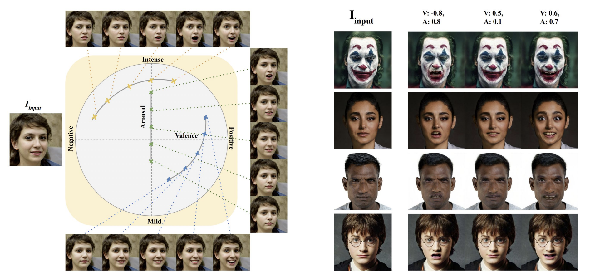

# 🙂😐🙁 EmoStyle: One-Shot Facial Expression Editing Using Continuous Emotion Parameters

 

    <a target='_blank'>Bita Azari</a>&emsp;
    <a href='https://www.sfu.ca/computing/people/faculty/angelicalim.html' target='_blank'>Angelica Lim</a>&emsp;

 

    Simon Fraser University &emsp;

 
<i><strong><a href='https://openaccess.thecvf.com/content/WACV2024/papers/Azari_EmoStyle_One-Shot_Facial_Expression_Editing_Using_Continuous_Emotion_Parameters_WACV_2024_paper.pdf' target='_blank'>WACV 2024</a></strong></i>
 
<!--  
  

    
  

  -->

> ** EmoStyle: One-Shot Facial Expression Editing Using Continuous Emotion Parameters** 
> Bita Azari, Angelica Lim  
>
>**Abstract:** Recent studies have achieved impressive results in face generation and editing of facial expressions. However, existing approaches either generate a discrete number of facial expressions or have limited control over the emotion of the output image. To overcome this limitation, we introduced EmoStyle, a method to edit facial expressions based on valence and arousal, two continuous emotional parameters that can specify a broad range of emotions. EmoStyle is designed to separate emotions from other facial characteristics and to edit the face to display a desired emotion. We employ the pre-trained generator from StyleGAN2, taking advantage of its rich latent space. We also proposed an adapted inversion method to be able to apply our system on out-of-StyleGAN2 domain (OOD) images in a one-shot manner. The qualitative and quantitative evaluations show that our approach has the capability to synthesize a wide range of expressions to output high-resolution images.

 
  

    
    
  

 

